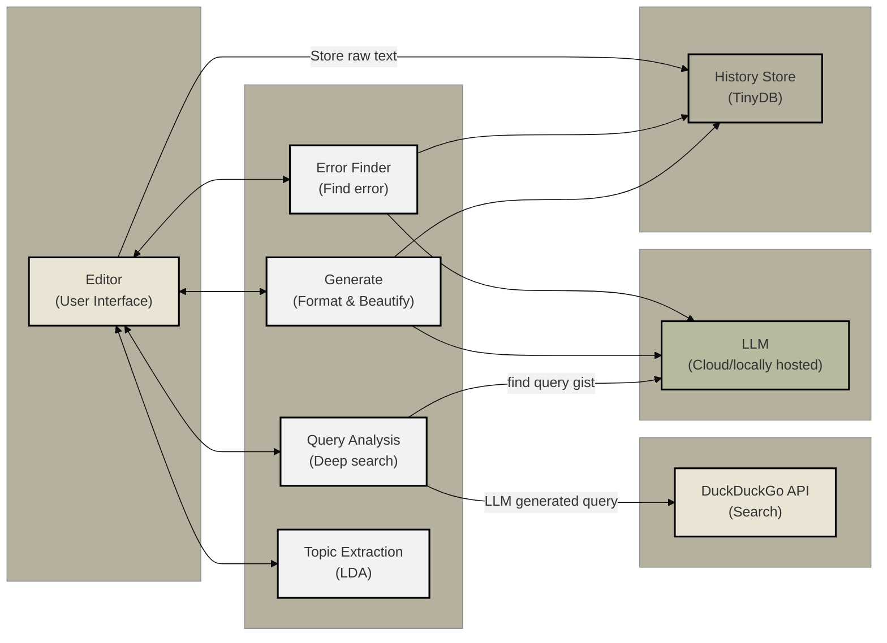

# CogniJot
AI-powered academic note-taking tool that beautifies, refines, and corrects errors in your notes.

## Description
A lightweight web application built with FastAPI that provides an interface for writing, formatting, error-checking, and exploring text. 
Users can compose and beautify text, highlight mistakes with suggestions, extract topics and keywords, perform deep searches based on the gist of their text, 
and store notes for future reference.

## High-Level Design

## Key Features
- **Text Editor**  
  Format and beautify your text using a rich content-editable area.
- **Error Checking**  
  Automatically find errors (e.g. grammatical, mathematical etc.) and view suggestions via hover tooltips.
- **Topic & Keyword Extraction**  
  Extract up to 10 unique keywords or topics from your text as colorful tags.
- **Deep Search**  
  Perform a “deep search” by sending the gist of your text to a search engine and view curated results directly in the UI.
- **Note Storage & History**  
  Save, load, edit, and delete notes in the left-hand history panel.

## Contributing

I’d love your help! Here’s how you can get involved:

- **Report issues**: Let us know if you find any bugs or have ideas for improvements.  
- **Suggest features**: Have a new idea? Open an issue to share your thoughts.  
- **Help with documentation**: Clarify instructions, fix typos, or add examples.  
- **Submit fixes**: If you know how to solve a problem, send us a pull request.

